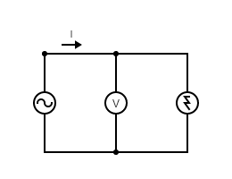

# Sedovanie sinusového napätia generátora osciloskopom

### Schéma zapojenia



### Tabuľka nameraných a vypočitaných hodôt

```
|U [V]     |1     |2     |
|Um vyp [V]|      |      |
|Um nam [V]|      |      |
|Us vyp [V]|      |      |
```
```
|U = 1V                  |
|Tnam [s]  |      |      |
|f vyp [Hz]|      |      |
```

$$f_r = \frac{1}{2\pi\sqrt{LC}}
f_r = \frac{1}{2\pi\sqrt{100\cdot10^{-3}\cdot10\cdot10^{-6}}}
f_r = \frac{1}{2\pi\cdot10^{-2}}
f_r = 159,2 Hz$$