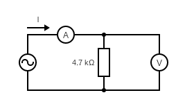

# Výkon, práca striedavého prúdu

### Teoretický úvod

$$P = U\times I\times cos(φ) [W] - uzitočný\hspace{1mm} P$$
$$Q = U\times I\times sin(φ) [VAr] - neuž.\hspace{1mm} P$$
$$S = U\times I [VA] max.\hspace{1mm} P$$

### Schéma zapojenia



### Súpis pomôcok

1. Multimeter (A)
2. Multimeter (V)
3. Vodič
4. Rezistor
5. AC zdroj

### Tauľka

```
|U   |U [V] |I [A] |P [W]  |Q [VAr] |S [VA]  |
|R1  |,2    |3,9   |0.0007 |0,0046  |0.00468 |
|R2  |1     |7     |0.0006 |0.0069  |0.007   |
```