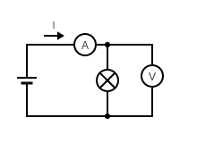

# Meranie VACH nelineárneho rezistora (žiarovky)

### Úloha
- zmerajte U a I a pomocou ohmovho zákona vypočítajte R
- graficky znázornite graf žiarovky

### Teoretický úvod
- nelineárny R žiarovky

### Schéma zapojenia



### Súpis pomôcok a meracích prístrojov

1. Multimeter (A)
2. Multimeter (V)
3. Vodič
4. Žiarovka

### Tauľka

```
|U [V]         |0     |2     |4     |6     |8     |10    |12    |
|I [mA]        |0     |25,3  |38    |48,3  |57,3  |65,3  |72,6  |
|Rž = U:I [Ohm]|0     |75,1  |105,3 |124,2 |139,9 |153,9 |165,3 |
```

### Vzor výpočtu

Rž = U/I = 2/25,3 = 75,1 Ohm

### Záver

- pomocou merania sme si overili že VACH žiarovky je graf krivky
