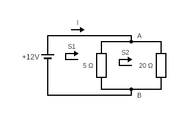

# Zjednodušovanie schémy zapojenia

$$ R = R_3 {R_1 R_2 \over R_1 + R_2} = 12 Ohm $$

$$ I = {U \over R} = {12 \over 6} = 2A $$
# Met. KZ

### 1. $$ A:\hspace{5mm} I = I_1 + I_2 $$
### 2. $$ S_1:\hspace{5mm} -U + UR_1 + UR_3 = 0 $$
### 3. $$ S_2:\hspace{5mm} UR_2 = UR_1 = 0 $$
